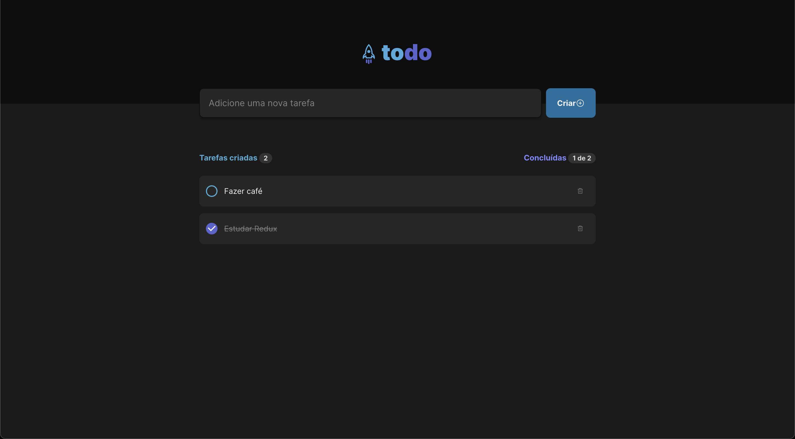

<h1>ToDo React App</h1>

  <a href="#-tecnologias">Tecnologias</a>&nbsp;&nbsp;&nbsp;|&nbsp;&nbsp;&nbsp;
  <a href="#-projeto">Projeto</a>&nbsp;&nbsp;&nbsp;|&nbsp;&nbsp;&nbsp;

 

  

## 🚀 Tecnologias

Esse projeto foi desenvolvido com as seguintes tecnologias:

- React.js
- Typescript
- CSS Modules
- Phosphor icons

## 💻 Projeto

O Objectivo da aplicação é construir uma lista de Todo para treinar conceitos como:
- Gerenciamento de estado
- Imutabilidade
- Listas e keys 
- Propriedades e componentização no React. 
- Closures
- Typescript
- Responsividade
- Estilização de componentes HTML
- Boas práticas no React

---

Feito com ♥ by Daniel Koti
